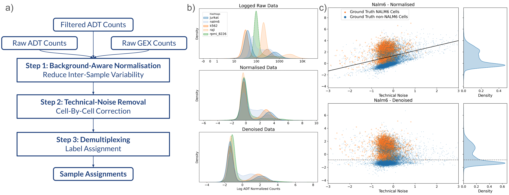

# HTO DND - Demultiplex Hashtag Data

[](https://badge.fury.io/py/hto)
[](https://github.com/sail-mskcc/hto_dnd/actions/workflows/test.yml)

`hto` is a Python package for efficient and accurate **hashtag multiplexing** demultiplexing of hash-tagged oligonucleotides (HTOs) in **single-cell** data.
Hashtag multiplexing lets many single-cell samples be pooled into one run; `hto` recovers each cell's sample of origin from the HTO signal.
It normalises based on observed background signal and denoises the data to remove batch effects and noise:

- **Normalization**: Normalize HTO data using background signal, inspired by the DSB method (see citation below).
- **Denoising**: Remove batch effects and noise from the single-cell data by regressing out cell-by-cell variation.
- **Demultiplexing**: Cluster and classify cells into singlets, doublets, or negatives. The default method is `otsu_weighted`; `otsu`, `otsu_biased`, `kmeans`, `gmm`, and `gmm_demux` are also available.

The package supports command-line interface (CLI) usage and Python imports, and ships a Cromwell/WDL pipeline (see [`pipeline/`](./pipeline)) that takes hashtag multiplexing experiments from raw FASTQs to demultiplexed single-cell results.



## Installation

Using `pip`:

```bash
pip install hto
```

From source:

```bash
git clone https://github.com/sail-mskcc/hto_dnd.git
cd hto_dnd
pip install .
```

## Usage

### Python API

The python API is built around AnnData. It is highly recommended two work with three AnnData objects:

* `adata_hto`: Filtered AnnData object with HTO data, containing only actual cells.
* `adata_hto_raw`: Raw AnnData object with HTO data, containing actual cells and background signal.
* `adata_gex`: Raw AnnData object with gene expression data. This is optional and can be used to construct a more informative background signal.

```python
import hto

# get mockdata
mockdata = hto.data.generate_hto(n_cells=1000, n_htos=3, seed=10)
adata_hto = mockdata["filtered"]
adata_hto_raw = mockdata["raw"]
adata_gex = mockdata["gex"]

# denoise, normalize, and demultiplex the hashtag multiplexing signal
# (demux_method defaults to "otsu_weighted")
adata_demux = hto.demultiplex(
  adata_hto,
  adata_hto_raw,
  adata_gex=adata_gex,
)

# see results: each single cell is assigned to its sample of origin
adata_demux.obs[["hash_id", "doublet_info"]].head()
```

### Command-Line Interface (CLI)

The CLI provides an API for the `hto demultiplex` scripts. Make sure to define `--adata-out` to save the output.

```
hto demultiplex \
  --adata-hto /path/to/adata_hto.h5ad \
  --adata-hto-raw /path/to/adata_hto_raw.h5ad \
  --adata-gex /path/to/adata_gex.h5ad \
  --demux-method otsu_weighted \
  --adata-out /path/to/output.h5ad
```

`--demux-method` defaults to `otsu_weighted`. Run `hto demultiplex --help` for all options.

### Cromwell / WDL pipeline

For processing hashtag multiplexing experiments end-to-end (raw FASTQs → aligned counts → demultiplexed single-cell AnnData + QC report), an alevin-fry based Cromwell/WDL pipeline is provided in [`pipeline/`](./pipeline). See [`pipeline/README.md`](./pipeline/README.md).

## Data Requirements

`hto` requires data from single-cell hashtag multiplexing (cell hashing) experiments where samples are labeled with hashtagged antibodies:

- **HTO data** (`adata_hto`): Filtered cell × HTO count matrix in AnnData format.
- **Raw HTO data** (`adata_hto_raw`): Unfiltered barcode × HTO count matrix including empty droplets. Required for background estimation.
- **Gene expression data** (`adata_gex`, recommended): Cell × gene count matrix for improved background estimation.
