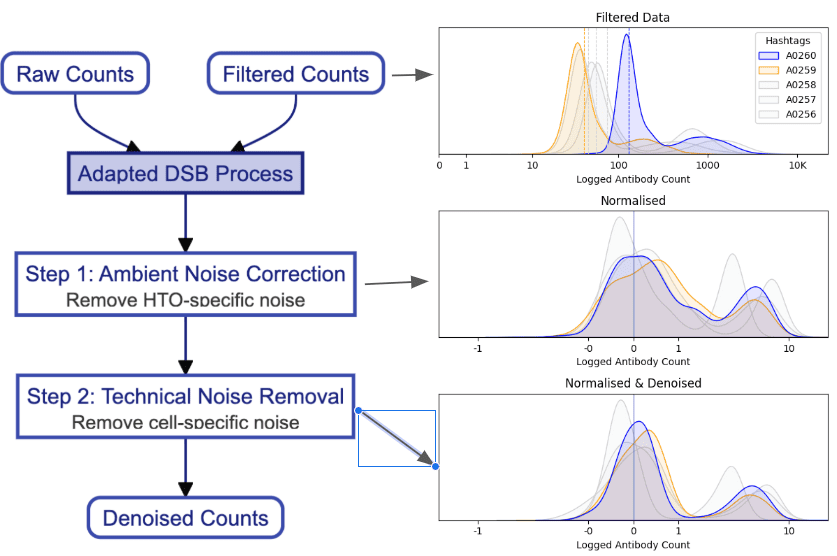

# HTO DND - Demultiplex Hashtag Data

[](https://badge.fury.io/py/hto-dnd)
[](https://github.com/sail-mskcc/hto_dnd/actions/workflows/test.yml)

`hto` is a Python package designed for efficient and accurate demultiplexing of hash-tagged oligonucleotides (HTOs) in single-cell data.
It normalises based on observed background signal and denoises the data to remove batch effects and noise:

- **Normalization**: Normalize HTO data using background signal, inspired by the DSB method (see citation below).
- **Denoising**: Remove batch effects and noise from the data by regressing out cell by cell variation.
- **Demultiplexing**: Cluster and classify cells into singlets, doublets, or negatives using clustering methods like k-means or Gaussian Mixture Models (GMM).

The package supports command-line interface (CLI) usage and Python imports.



## Installation

Using `pip`:

```bash
pip install hto
```

From source:

```bash
git clone https://github.com/sail-mskcc/hto_dnd.git
cd hto_dnd
pip install .
```

## Usage

### Python API

The python API is built around AnnData. it is highly recommended two work with three AnnData objects:

* `adata_hto`: Filtered AnnData object with HTO data, containing only actual cells.
* `adata_hto_raw`: Raw AnnData object with HTO data, containing actual cells and background signal.
* `adata_gex`: Raw AnnData object with gene expression data. This is optional and can be used to construct a more informative background signal.

```python
import hto

# get mockdata
mockdata = hto.data.generate_hto(n_cells=1000, n_htos=3, seed=10)
adata_hto = mockdata["filtered"]
adata_hto_raw = mockdata["raw"]
adata_gex = mockdata["gex"]

# denoise, normalize, and demultiplex
adata_demux = hto.demultiplex(
  adata_hto,
  adata_hto_raw,
  adata_gex=adata_gex,
  inplace=False,
)

# see results
adata_demux.obs[["hash_id", "doublet_info"]].head()
```

### Command-Line Interface (CLI)

The CLI provides an API for the `hto demultiplex` scripts. Make sure to define `--adata-out` to save the output.

```
hto demultiplex \
  --adata-hto /path/to/adata_hto.h5ad \
  --adata-hto-raw /path/to/adata_hto_raw.h5ad \
  --adata-gex /path/to/adata_gex.h5ad \
  --adata-out /path/to/output.h5ad
```
